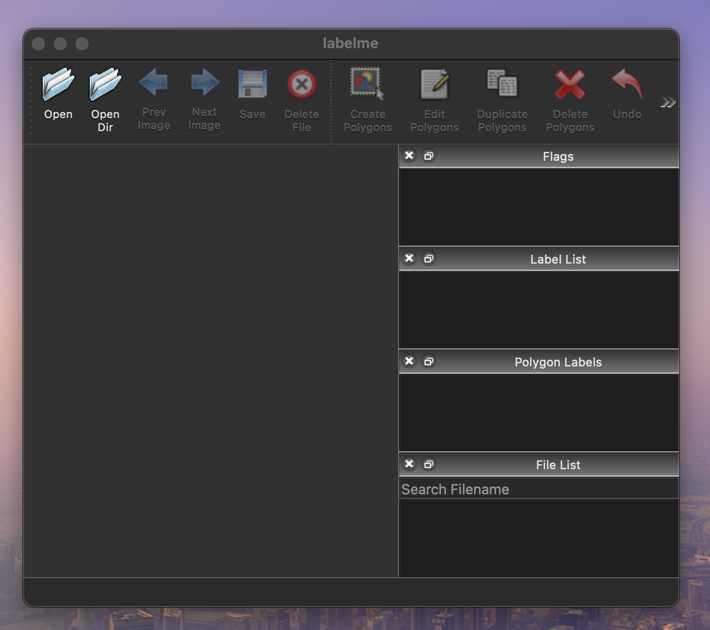
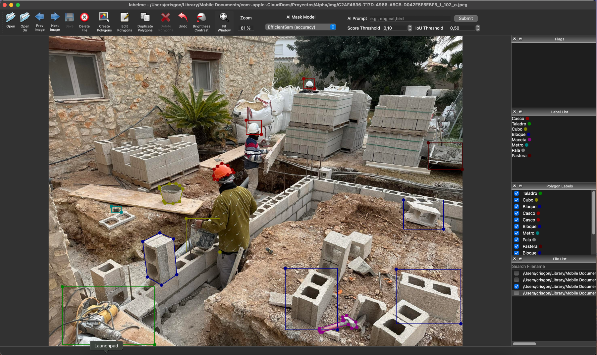
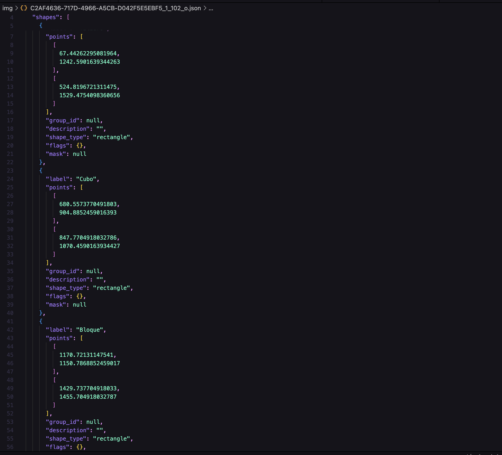

# Proyecto: Detección de Equipos de Protección, Materiales y Herramientas en Obras

Este proyecto tiene como objetivo desarrollar un sistema de visión artificial capaz de detectar equipos de protección individual, materiales de construcción y herramientas en la obra. Se utilizará inteligencia artificial y procesamiento de imágenes para reconocer automáticamente elementos como cascos, chalecos reflectantes, ladrillos, cemento, sierras, taladros y más.

# 1. Herramientas de Etiquetado

En este apartado se documentará la investigación de una herramienta de código abierto para el etiquetado de imágenes, la herramienta elegida en mi caso ha sido LabelMe.

LabelMe es una herramienta basada en Python para la anotación de imágenes manual, lo cual se usa para la creación de datasets de segmentación y reconocimiento de objetos en visión por ordenador.

He elegido esta herramienta por la compatibilidad con Macbook Apple Silicon, tiene una interfaz simple y fácil de trabajar. 

### Creación del entorno virtual

Lo primero que he hecho es crearme un entorno virtual para trabajar con LabelMe y no tener problemas con las librerías (he creado una carpeta con mis venvs para una mejor organización). Para trabajar con LabelMe se necesitará un par de imagenes para hacer unas cuantas pruebas, dado que trabajo en la obra mi proyecto estará relacionado con la construcción, tengo algunas imagenes tomadas en la obra que podré etiquetas con LabelMe. 

### Funcionamiento de LabelMe

Una vez elegidas las imagenes he investigado sobre el funcionamiento de LabelMe, esta es una aplicación que hay que abrir mediante la terminal en el entorno virtual.

En el entorno de LabelMe podemos abrir varias imagenes para proceder con el etiquetado, en esta imagen uso varias etiquetas en forma de poligono y rectangulo, pero hay muchas más opciones disponibles como la creación de una etiqueta en circulo, linea, punto, entre otras.

La cosa es ir objeto por objeto marcando lo que es, con los cascos he usado tanto poligono como rectangulo, al igual que con los cubos y bloques, cada objeto que etiquetes tendrá un color diferente si se trata de un objeto diferente. Hay opciones como eliminar y editar el etiquetada, por si se quiere ajustar aún más el etiquetado. 

Cuando tenía listo el etiquetado de esta imagen procedí a guardarla dando como resultado un archivo JSON con toda la información del etiquetado, la versión, las figuras, el nombre, y la etiqueta y los puntos que es lo que nos interesa realmente. Aquí tenemos como se ve la etiquetación de labelme una vez guardada.

Tambien tiene una función interesante que visualiza la imagen normal y la imagen una vez etiquetada, con la leyenda de las etiquetas. El comando a utilizar ha sido labelme_draw_json imagenetiquetada.json

